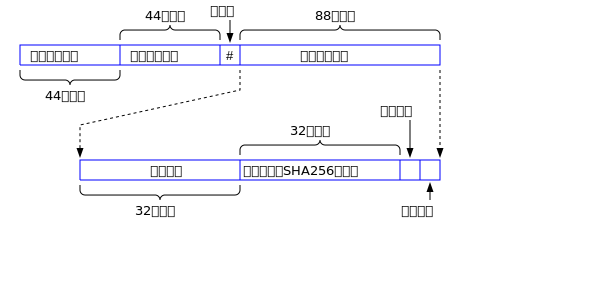

# WoChat消息的加密规范


本文档论述WoChat加密明文的规范。

## 加密的设计思想概述

假设我们要发送的明文数据有n个字节，可以使用如下C语言变量来表示：

```c
unsinged char message[n];
```

真正的数据采用流加密算法。流加密算法的一个特征就是明文和密文的长度相等。因为我们在聊天过程中大部分时间输入的文字长度都很短，譬如：你好啊，非常棒！赞一个！ 我要下线了，你多保重等等。 为了不让攻击者获得短明文的长度信息，我们做如下设计：如果n小于252个字节，我们就构造一个252字节的随机数据包，把明文数据作为一个整体，嵌入到这个随机数据包中。明文在这个数据包中的存放是连续的，所以我们需要两个变量来标记明文在这252字节中的位置：长度n和偏移量offset。n的取值范围是1到251。offset的取值范围是0到252 - n。 为什么选择252呢？目的是为了让整体的长度是3的倍数，经过base64编码后就不存在补齐的等号(=)了。

如果n大于等于252个字节，则不需要上面的凑齐操作，所以offset恒定为0。

经过上面处理的明文，如何进行加密呢？ 我们会产生一个32字节的随机数，作为加密所使用密钥Ks，使用流加密算法Chacha20对真正的数据进行加密。Ks被称为会话密钥(session key)，所谓会话(session)密钥，指的是每次(session)加密操作都选择不同的密钥。很显然，Ks是需要随着加密后的密文一起发送给接收者的，我们不可能把Ks的明文发送给接收者，否则任何人都可以解密了。所以我们必须要对Ks进行加密。对Ks加密所使用的算法是AES256，所使用的密钥是Kp，32个字节。Kp被称为主密钥(primary key) ，它是由发送方的私钥sK1和接收方的公钥pK2计算出来的。同时，接收方的私钥sK2和发送方的公钥pK1也可以计算出K。 其中sK表示secret Key，pK表示public Key。 一个发送者和一个接收者之间的通讯数据所使用的主密钥Kp是固定不变的，这是椭圆曲线算法的重要特点。WoChat就是利用这个机制，在发送者无需向接收者传递Kp的情况下，依然可以完成加密和解密的操作。下面的公式展示了主密钥Kp的基本规律：

```
Kp = f(sK1, pK2) = f(sK2, pK1)
```

总结一下：真正的数据使用Chacha20流加密技术，一次一密，所使用的密钥Ks是32字节的随机数，Ks被称为会话密钥。 Ks由AES256算法进行加密，所使用的密钥Kp是利用椭圆曲线的公钥和私钥计算出来的。因为双方都可以计算出相同的Kp，所以Kp无需传递，窃听者就无从窃听。 概括成两句话，那就是：主密钥Kp加密会话密钥Ks，Ks加密真正的数据。每次加密，Ks都不一样，而Kp是固定的。

所以整个安全体系的基础在于发送方的私钥sK1和接收者的私钥sK2不被泄露。只要这个前提条件被满足，整个安全加密的体系是没有任何明显的漏洞的。

以上就是WoChat加密规范的基本思想。 在理解了基本思想后，我们来看看WoChat加密消息包的具体格式。

## 加密格式的具体规范

WoChat消息包分为三种类型，包含真正数据的普通消息包、收到消息的确认消息包和要求撤销消息的请求消息包。下面依次论述这三种不同类型的消息包。

### 包含真正数据的普通消息包

在WoChat通讯过程中，这种消息包属于最常见的类型，因为其中包含通讯双方真正想交流的数据。这些数据可以是文本，也可以是图片、视频等二进制信息。 这种消息包的规范可以用下图表示。

 

如图所示，整个消息包分为三部分，下面介绍每一个部分的内容。

#### 消息包的第一部分

消息包的第一部分就是头66个字节。它记录着发送者的公钥的字符串。因为椭圆曲线公钥是33个字节，变成人可读的字符串就是66个字节，譬如一个字节0xA3变成了'A3'，这是两个字节。所以33个字节的原始公钥变成人可读的形式，就是66个字节。 接收者的公钥就是接收到数据包的MQTT的主题(topic)，所以消息包中不包含接收者的公钥，只包含发送者的公钥。虽然任何人都可以在接收者的公钥的topic上接收消息包，但是只有拥有接收者公钥对应的私钥的人才可以解开消息包，所以不怕别人偷听。 这部分的数据没有采用base64编码，目的是为了方便程序开发过程中的调试。

#### 消息包的第二部分
就是消息包的第67个字符，它固定是竖线符号|，表示和后面的数据包的分隔符。从第68个字节开始到最后，都是base64编码的数据。

#### 消息包的第三部分

从第68个字节开始到消息包的最后，都是base64编码的数据。这些数据是消息包的第三部分。

base64编码的数据经过base64解码后，分为五个域。头四个域的长度是固定的，分别是32字节，4字节，4字节和32字节。第五个域保存真正的数据，它的长度n是可变的，最小是252个字节。MQTT消息包的最大长度是256MB，所以n的最大值大约是256MB，扣除在它前面的字节的开销。

除了第一个域以外，后面四个域的数据都是经过Chacha20流加密算法加密的。所以你必须先用Chacha20进行解密，才能够解读里面的内容。解密的密钥Ks是32个字节，保存在第一个域中。Ks又是被主密钥K使用AES256加密算法加密的。K是由发送方的私钥sK1和接受方的公钥pK2计算出来的。

这五个域的含义分别论述如下。
##### 第一个域

第一个域是头32个字节，保存会话密钥Ks。当然Ks是经过主密钥Kp使用AES256加密算法加密的。

##### 第二个域
第二个域是第一个域随后紧挨的4个字节。它记录后面真正数据包的长度。该域按照小端格式(little-endian)存放。譬如长度是1193046个字节，就是十六进制的0x123456。则这个域的四个字节中，第一个字节保存56，第二个字节保存34，第三个字节保存12，第四个字节保存0。

##### 第三个域
第三个域是第二个域随后紧挨的4个字节。这四个字节目前只使用了头3个字节，最后一个字节保留供未来使用。 这个域的第一个字节，表示加密规范的版本，目前恒定为1。 第二个字节表示后面的数据的类型。T表示文本类型，不是T则表示二进制类型，譬如图片或者视频等信息。这个字节的取值可以是：
- T 表示文本
- G 表示GIF格式的图片
- P 表示PNG格式的图片
- J 表示Jpeg格式的图片
- B 表示BMP格式的图片
- M 表示MP4的视频
- m 表示mp3格式的音频
- S 表示SWF格式专用的教育视频格式

这个列表还可以继续扩充。这部分未来会进一步规范。

第三个字节表示真正的数据在后面n个字节中的偏移量。如果真正的数据大于等于252，则这个字节的值恒定为0。 如果真正的数据长度n小于252，则这个字节的取值范围是0到252 - n 。

第四个字节保留未用，供将来使用。

##### 第四个域
第四个域是32字节，表示真正数据的SHA256的哈希值。 如果明文的长度是52个字节，它保存在252字节的随机数据包中，偏移量的取值范围是0到200。 这该域计算的是52个字节的SHA256哈希值，不包括那些随机填充的数据。

##### 第五个域

第五个域就是真正的数据了，它的长度为n。前面已经讲过了，如果发送的消息长度小于252字节，则真正的数据包包含在一个252字节的随机数据包中。所以n的最小值为252。 由于汉字在UTF16下通常是2个字节，在UTF8下是3个字节，为了节省流量，真正的文本数据采用UTF16编码。对于图片视频等二进制文件，就不存在编码的问题了，该是啥就是啥。

##### 一点优化

第二个域和第三个域共计8个字节。里面的明文数据，除了最后两个字节以外，其余六字节的明文，攻击者是可以知道的，譬如第一个字节的明文是1；如果发送的是文字，这第二个字节是'T'。长度信息也是可以通过人为的设计而获悉。所以攻击者会把这6字节的密文和明文进行异或(XOR)，就可以获得加密这6字节的流加密的比特流。如果攻击者获得了Chacha20输出的头48比特的密钥，是否会对他攻击Chacha20算法和密钥起到某种提示作用呢？我不是安全专家，不清楚这个问题。但是不让攻击者知道开始的48比特密钥总比让他知道要强一些。

为了不让攻击者获得开始的48比特的密钥，可能这个信息对整体的共计也没啥帮助，不过为了小心起见，这里做了一个优化。我们把第一个域的32字节，计算出一个CRC32C的值，4个字节。然后利用这四个字节和第二、三个域的八个字节进行异或，这样的操作可以防止攻击者获得Chacha20输出的头48比特的值。 这样的设计可能会堵住一些潜在的漏洞，谁知道呢？。有这个设计比没有强，至少不差，我们就加上这道保险栓。 


### 确认消息包

当接收方收到普通消息包后，会对消息包进行解密和验证。验证的工作就是比对实际内容和消息包头的SHA256值是否相等，这个值是32个字节。 每一个消息都有一个独一无二的SHA256值。 当校验无误后，接收方会向发送方发送一个确认消息包。这种消息包的格式可以用下图表示：

 

这种消息包格式很简单，共计131个字节。头66个字节是接收者的公钥，中间一个加号，再后面64个字节表示解密后的消息的SHA256值。 发送者拿到这个消息包后，和自己发送的消息的SHA256进行校验后，就可以知道接收者的的确确收到了自己的消息，他可以在界面上做一些标记，譬如在消息的右上角加上一个勾号，知道对方的的确确收到了自己的消息。

### 请求消息包

发送者发送消息后，在一定时间内，譬如30秒之内，突然后悔了，想撤回自己发送的消息，就向接收者发送如下格式的消息包。但是接收者是否接受撤回，由接收者说了算。譬如接收者编译WoChat源码时禁止撤回消息功能。 所以这个消息包仅供接收者参考，是否撤回的权力在接收者。

 

这种消息包格式很简单，共计131个字节。头66个字节是发送者的公钥，中间一个减号，再后面64个字节表示解密后的消息的SHA256值。 接收者拿到这个消息包后，和自己接受到的消息解密后的SHA256进行校验后，就可以知道发送者要求撤销哪个消息包。 是否撤销的动作由接收者说了算。


## 意见反馈

有任何问题，请发信到wochatdb@gmail.com


