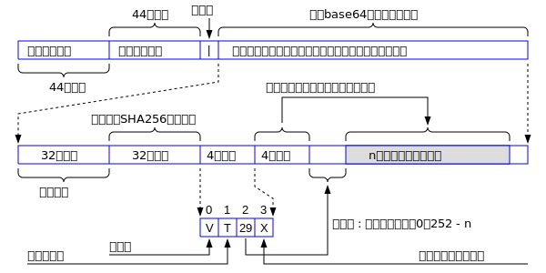

# WoChat消息协议规范

WoChat消息包的规范可以用下图所示。任何一个消息包分为三部分，下面依次论述之。

 

## 消息包的第一部分

消息包的第一部分就是头66个字节。它记录着发送者的公钥的字符串。因为椭圆曲线公钥是33个字节，变成人可读的字符串就是66个字节，譬如一个字节0xA3变成了'A3'，这是两个字节。所以33个字节的原始公钥变成人可读的形式，就是66个字节。 接受者的公钥就是接收到数据包的MQTT的主题(topic)，所以消息包中不包含接受者的公钥，只包含发送者的公钥。虽然任何人都可以在接受者的公钥的topic上接收消息包，但是只有拥有接受者公钥对应的私钥的人才可以解开消息包，所以不怕别人偷听。

## 消息包的第二部分
就是消息包的第67个字符，它固定是竖线符号|，表示和后面的数据包的分隔符。从第68个字节开始到最后，都是base64编码的数据。

## 消息包的第三部分

从第68个字节开始到消息包的最后，都是base64编码的数据。这些数据是消息包的第三部分。

base64编码的数据经过base64解码后，分为四个域。头三个域的长度是固定的，分别是32字节，4字节和4字节。第四个域保存真正的数据，它的长度是可变的，从0个字节到n个字节。因为MQTT消息包的最大长度是256MB，所以n的最大值大约是256MB，扣除在它前面的字节的开销。

所有这四个域的数据都是经过Chacha20流加密算法加密的。所以你必须先用Chacha20进行解密，才能够解读里面的内容。加密的密钥K是32个字节。用数据公式来表示，Chacha20所使用的密钥K定义如下：
```
K = f(SK1, PK2)
K = f(SK2, PK1)
```

其中SK1是发送者的私钥，PK1是发送者的公钥。SK2是接收者的私钥，PK2是接受者的公钥。私钥是双方都要严格保密的，公钥是对外公开的，任何人皆可获知。上述公式表明：加密的密钥K既可以用我方的私钥和对方的公钥计算出来，也可以用对方的私钥和我方的公钥计算出来。所以消息的发送方和接收方在传递加密信息时，不需要传递K，分别在本地进行计算即可。 整个安全模型建立在私钥SK1和SK2不被泄露的基础上。只要双方的私钥没有泄露，整个安全模型是非常完善的。

这四个域的含义分别论述如下。
### 第一个域

第一个域是头32个字节，为真正消息包的SHA256的哈希值，就是只计算后面n个字节的数据的哈希值，不包括紧随的8个字节。

### 第二个域
第二个域是第一个域随后紧挨的4个字节，它的值为n，表示后面的真正数据是n个字节。其实这个长度信息在消息包被Base64解码后就可以计算出来。这里设置这个域是为了多一道校验，确保长度符合。因为攻击者已经知道这个值了，他会反推出来Chacha20对这四个字节的加密密钥32比特。为了提高抗攻击能力，这里做了一点小优化。就是第一个域的SHA256哈希值计算出CRC32C的值，也是4个字节，会和这个域表示的长度信息进行异或(XOR)，相当于二重流加密。


### 第三个域
第三个域是第二个域随后紧挨的4个字节。所以第一、二、三个域的字节长度为32 + 4 + 4 = 40个字节。

这个域的第0个字节，表示后面的数据的类型，T表示文本类型，不是T则表示二进制类型，譬如图片或者视频等信息。和第二个域一样，这个域的信息也会使用第一个域的CRC32C的32比特再次进行流加密，提高抗分析的能力。

流加密的特征是明文和密文的长度相同，这给了攻击者明文长度的信息。所以我们这里做了一个优化，就是如何发送的真正的消息包长度n小于256个字节，我们构造一个256字节的随机数组成的消息包，把真正的数据内嵌其中。消息包的偏移量由第1个字节表示。它的取值范围是0到255。

第3和第4个字节保留，里面的内容为随机值。


### 第四个域

第四个域就是真正的数据了，它的长度为n。如果n<256，则真正的数据包包含在一个256字节的随机数据包中。所以n的最小值为256。 如果第三个域的第0个字节为T，则表示本数据域的内容是文本。由于汉字在UTF16下通常是2个字节，在UTF8下是3个字节，为了节省流量，真正的文本数据采用UTF16编码。对于图片视频等二进制文件，就不存在编码的问题了，该是啥就是啥。


有任何问题，请发信到wochatdb@gmail.com


